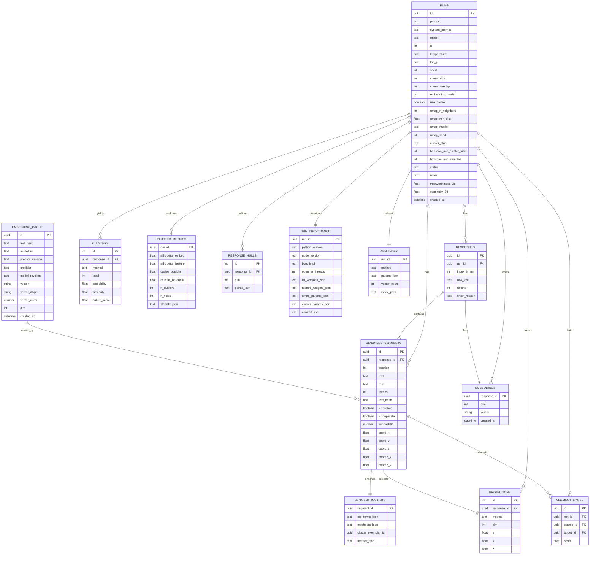
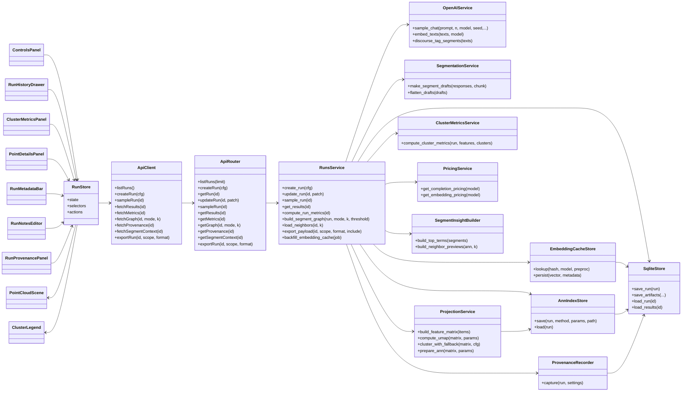
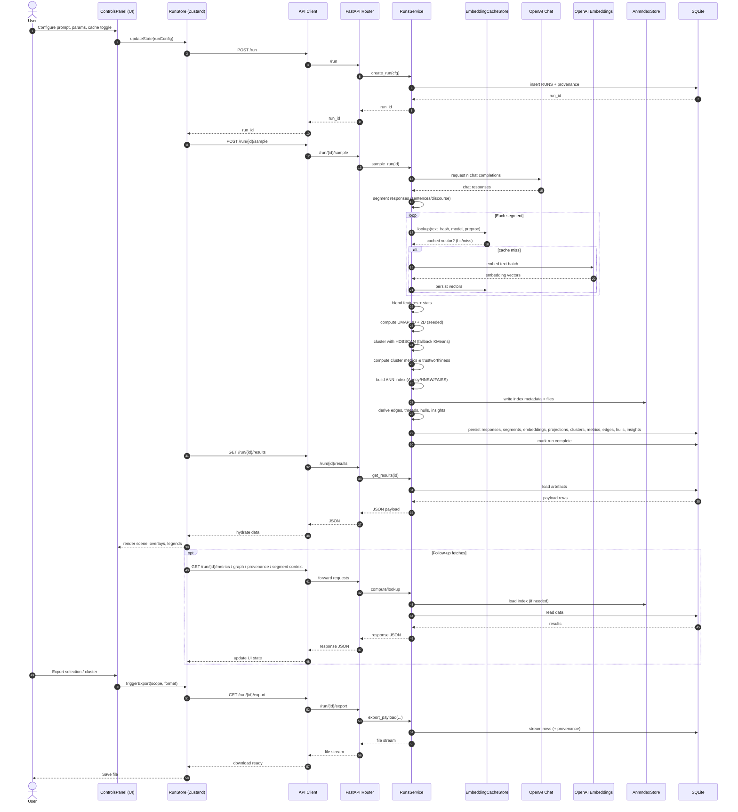

# Semantic Landscape Sampler

[](./2025-09-27_17-46-43.mp4)

Semantic Landscape Sampler turns a single research prompt into a semantic atlas. It fans your prompt across many LLM completions, breaks responses into discourse segments, blends multiple feature views, and renders an interactive 2D/3D point cloud that stays in sync with similarity edges, parent threads, hulls, and density overlays. The backend pipelines sampling, caching, embeddings, projections, clustering, provenance, and exports; the frontend gives you a lab for exploring every dot with rich context.

## Table of Contents
- [Overview](#overview)
- [What's New](#whats-new)
- [Plain-English Tour](#plain-english-tour)
- [Repository Layout](#repository-layout)
- [Key Capabilities](#key-capabilities)
  - [Backend](#backend)
  - [Frontend](#frontend)
- [Architecture](#architecture)
- [Prerequisites](#prerequisites)
- [Environment Configuration](#environment-configuration)
- [Backend Setup](#backend-setup)
- [Frontend Setup](#frontend-setup)
- [Running the Stack](#running-the-stack)
- [Using the Visualiser](#using-the-visualiser)
  - [Controls Reference](#controls-reference)
  - [Exploration Tips](#exploration-tips)
- [Data Model & Persistence](#data-model--persistence)
- [API Endpoints](#api-endpoints)
- [Testing & Quality Gates](#testing--quality-gates)
  - [Backend](#backend-1)
  - [Frontend](#frontend-1)
- [Seed Sample Data](#seed-sample-data)
- [How Is This Mapped?](#how-is-this-mapped)
- [Roadmap & Next Steps](#roadmap--next-steps)
- [Contributing](#contributing)
- [Rendering Pipeline (Mermaid)](#rendering-pipeline-mermaid)

## Overview

Semantic Landscape Sampler is built for rapid sense-making of large language model output. Instead of leafing through dozens of transcripts, you choose a prompt and number of completions. We sample the LLM, split responses into sentences or discourse roles, build blended feature vectors, map them with UMAP, cluster with HDBSCAN, and surface overlays so you can explore the space visually or export it for downstream analysis. Everything is persisted so you can revisit runs, tune parameters, and compare experiments.

## What's New

- **Embedding cache with duplicate tracking**: Normalise text (NFKC + whitespace collapse), hash it, and reuse vectors across runs while still logging duplicate segments when cache is disabled. Cached vectors store dtype, norm, provider, and revision metadata.
- **Processing timeline telemetry**: Each sampling run now records total runtime and per-stage durations (LLM call, segmentation, embeddings, clustering, ANN build, persistence). The UI surfaces the totals via badges and a timeline panel, and metrics/exports include the breakdown.
- **UMAP control presets and quality gauges**: Configure neighbours, min-dist, metric, and seeds from the UI with guardrails. Trustworthiness and continuity gauges show how faithful the 2D/3D projections are for each run.
- **Run provenance**: Every run records Python, Node, BLAS/OpenMP, library versions, feature weights, seeds, and commit SHA. Provenance is embedded in exports and surfaced in the UI.
- **Approximate nearest-neighbour graph**: Build Annoy (with hnswlib/FAISS fallbacks) indices on blended feature vectors, optionally PCA-compressed. Toggle between full and simplified (mutual-k, MST + bridges) edge graphs in the viewer.
- **Enriched tooltips and neighbour context**: Segment insights precompute TF-IDF top terms, exemplar medoids, neighbour previews, and similarity metrics so hover cards and detail drawers explain why a point sits where it does.
- **Fine-grained exports**: Stream run/cluster/selection/viewport exports in CSV/JSON/JSONL/Parquet with schema versions and optional provenance/vectors included.
- **Cluster tuning & metrics**: Adjust HDBSCAN parameters after a run, review silhouette (embedding + feature space), Davies-Bouldin, Calinski-Harabasz, and per-cluster stability charts.
- **UI polish**: Shared spread/centering keeps hulls, edges, and density meshes aligned; run history drawer, notes, duplicate filters, simplified edge toggle, neighbour "octopus" spokes, and cache badges make navigation quicker.

## Plain-English Tour

Think of the app as building a living map of ideas. Here is the journey without jargon:

1. **Ask a question**. You provide a prompt, optional system message, and choose how many completions to request. A jitter token can perturb prompts for additional variety.
2. **Gather answers**. The backend fans out to the selected OpenAI chat model, respecting temperature, top-p, seed, and max-token settings, and records raw responses plus usage stats.
3. **Break answers into pieces**. Sentences (optionally tagged with discourse roles) become segments so you can zoom from responses to clause-level insights.
4. **Describe each piece with numbers**. For every response and segment we blend OpenAI embeddings, TF-IDF fingerprints, prompt-similarity signals, and lightweight stats. The embedding cache deduplicates identical text across runs while logging duplicates within a run when the cache is off.
5. **Compress to coordinates**. UMAP, using the seed and parameters you chose, produces paired 3D and 2D layouts. Trustworthiness/continuity metrics quantify projection fidelity.
6. **Find structure**. HDBSCAN groups items; when it struggles, we fall back to KMeans. We compute soft memberships, outlier scores, centroids, keywords, and bootstrap stability. An ANN index gives us fast neighbour graphs and simplified edge nets.
7. **Persist everything**. Responses, segments, embeddings, projections, clusters, ANN metadata, hulls, edges, insights, and provenance are stored in SQLite (with WAL tuning).
8. **Explore visually**. The React viewer renders the point cloud plus hulls, density, parent threads, simplified edges, and neighbour spokes. Hovering shows top terms and neighbour previews, the side drawer reveals raw text and metrics, and legends toggle clusters, roles, outliers, cached badges, and duplicates.
9. **Export exactly what you need**. Any run, cluster, lasso selection, or viewport can be streamed as CSV/JSON/JSONL/Parquet with optional provenance and vector slices, ready for notebooks or dashboards.

If you remember only one thing: meaning lives in who is near whom. Axis labels are meaningless; proximity, clusters, hulls, and edges tell the story.

## Repository Layout

```text
.
+-- README.md                     # This guide
+-- backend/                      # FastAPI + SQLModel backend
¦   +-- app/
¦   ¦   +-- api/                  # FastAPI routers
¦   ¦   +-- core/                 # Settings
¦   ¦   +-- db/                   # Engine + migrations
¦   ¦   +-- models/               # SQLModel tables (runs, segments, cache, ANN, provenance)
¦   ¦   +-- schemas/              # Pydantic response/request models
¦   ¦   +-- services/             # Sampling, embeddings, projection, ANN, exports
¦   ¦   +-- utils/                # Text normalisation, token counting, pricing helpers
¦   +-- data/                     # SQLite db + persisted ANN indexes
¦   +-- tests/                    # Pytest suite with OpenAI mocks & golden files
¦   +-- requirements.txt          # Backend dependencies
¦   +-- pyproject.toml            # Ruff/Black tooling config
+-- frontend/                     # React + Vite + Tailwind client
¦   +-- src/
¦   ¦   +-- components/           # Controls, scene, panels, legends, history drawer
¦   ¦   +-- hooks/                # useRunWorkflow, segment context fetching
¦   ¦   +-- services/             # REST client wrapped with zod schemas
¦   ¦   +-- store/                # Zustand store + tests
¦   ¦   +-- types/                # Shared run/segment types mirroring backend
¦   +-- package.json              # Frontend dependencies & scripts
¦   +-- pnpm-lock.yaml            # Locked dependency graph
+-- CHANGELOG.md                  # Release notes
+-- CONTRIBUTING.md               # Contribution guidelines
+-- CODE_OF_CONDUCT.md            # Community expectations
+-- SECURITY.md                   # Vulnerability reporting
+-- THIRD_PARTY_NOTICE.md         # Licensing acknowledgements
+-- LICENSE, NOTICE               # Licensing documents
+-- .github/                      # Plans, workflows, and agent notes
```

## Key Capabilities

### Backend
- **Sampling orchestration**: `RunService` coordinates OpenAI chat completions, segmentation, embeddings, clustering, ANN building, hull generation, and persistence while streaming progress updates.
- **Embedding cache**: Normalises text (trim, whitespace collapse, NFKC, casefold), hashes content, and stores float16 vectors plus norms and metadata. Cache hits skip API calls; misses populate the cache. Cache opt-out still writes vectors and flags duplicates observed within a run.
- **Processing telemetry**: Captures per-stage timings (LLM sampling, segmentation, embeddings, UMAP, clustering, ANN build, persistence) and persists them for API clients.
- **Blended feature space**: Combines semantic embeddings, TF-IDF, prompt similarity, and statistics. Feature weights are recorded in provenance for reproducibility.
- **Projection & clustering**: UMAP generates 3D + 2D layouts with seeded determinism. HDBSCAN (with KMeans fallback) delivers soft memberships, probabilities, centroid similarities, silhouette/outlier scores, and optional parameter sweeps.
- **Quality metrics**: Trustworthiness/continuity (2D + 3D), silhouette (embedding + feature space), Davies-Bouldin, Calinski-Harabasz, and per-cluster stability summaries.
- **ANN graphs**: Builds Annoy indexes (optional PCA to 64/128 dims) with hnswlib/FAISS fallbacks, stores metadata in SQLite, serialises indices to disk, and exposes full or simplified graphs plus neighbour queries.
- **Segment insights**: Precomputes TF-IDF top terms, neighbour lists, medoid exemplars, and similarity explanations for tooltip/detail UX.
- **Exports & provenance**: Streams run/cluster/selection/viewport exports in multiple formats with schema versioning and optional provenance/vectors. All runs store provenance including library versions, seeds, hardware hints, and commit SHA.

### Frontend
- **State management**: Zustand store with selectors for view mode (2D/3D), level mode (responses/segments), cache badges, duplicates, role filters, outlier highlighting, and spread/density adjustments.
- **Controls panel**: Prompt, system message, jitter token, sampling count, temperature/top-p, seed/max tokens, chunk sizing, embedding model, cache toggle, UMAP preset dropdown, trustworthiness/continuity gauges, cluster tuning sliders, ANN graph toggles (full vs simplified, k value), duplicate filter, neighbour spokes toggle, and export actions.
- **Visual analytics**: React-three-fiber scene renders point cloud with shared spread/centering for hulls, edges, density, and parent threads. Hovering shows enriched tooltips; lasso selects segments/responses; duplicates and cache hits surface badges.
- **Context panels**: Detail drawer summarises metrics, top terms, neighbours, and parent responses. Metadata bar shows model choices, cache hit rate, quality gauges, cost estimates, and notes editor. Run history drawer lists recent runs with provenance and quick-load actions.
- **Processing timeline**: Metadata bar surfaces total runtime and badges show stage breakdowns; a dedicated timeline panel visualises per-stage durations.
- **Run workflow**: `useRunWorkflow` handles run creation, sampling, polling, metrics, provenance, graph, neighbour context, and incremental cluster recomputes while keeping UI responsive.

## Architecture

The project is split into a stateless FastAPI backend and a React/Vite frontend. Backend services persist data in SQLite, build ANN indexes under `backend/data/indexes/`, and expose JSON APIs. The frontend proxies API calls during development (`pnpm dev` proxies to `localhost:8000`), uses Zod to validate payloads, and renders the semantic landscape via WebGL.

Key data flow highlights:
- Runs carry cache flags, embedding model, UMAP settings, cluster tuning, and notes.
- Sampling jobs stream progress metadata so the UI can show toast updates.
- ANN indexes live alongside run data for fast rehydration.
- Provenance is collected once per run and attached to exports/UI.

## Prerequisites

- Python 3.11+
- Node.js 20+ (Corepack-enabled)
- pnpm 9+
- SQLite (bundled with Python)
- An OpenAI API key with access to the chosen chat + embedding models

Optional:
- FAISS GPU/CPU builds if you prefer FAISS over Annoy/HNSW (install separately)

## Environment Configuration

1. Copy `.env.example` to `.env` in the repository root.
2. Provide your `OPENAI_API_KEY` and override defaults as needed:
   - `DATABASE_URL` for alternate storage.
   - `OPENAI_CHAT_MODEL`, `OPENAI_EMBEDDING_MODEL`, `OPENAI_EMBEDDING_FALLBACK_MODEL`.
   - `DISCOURSE_TAGGING_MODEL` if using a separate annotator.
   - `UMAP_DEFAULT_SEED` to globally override layout seeds.
   - `DEFAULT_ENV_LABEL` to label provenance (dev/stage/prod).

## Backend Setup

```bash
cd backend
python -m venv .venv
# Windows PowerShell: .venv\Scripts\Activate.ps1
# macOS/Linux: source .venv/bin/activate
pip install -r requirements.txt
uvicorn app.main:app --reload --port 8000
```

The first launch creates `data/semantic_sampler.db`, applies WAL tuning, and ensures new columns (cache flags, UMAP params, metrics, insights) are present. ANN indexes are persisted under `backend/data/indexes/` when runs complete.

## Frontend Setup

```bash
cd frontend
corepack enable
pnpm install
pnpm dev  # http://localhost:5173, proxies backend on :8000
```

Vitest + React Testing Library are configured for store/component tests. `pnpm test -- --run` executes the suite in CI-compatible mode.

## Running the Stack

1. Start the backend (`uvicorn app.main:app --reload --port 8000`).
2. Start the frontend (`pnpm dev`).
3. Visit `http://localhost:5173` and enter a prompt plus sampling params.
4. Use the run history drawer to reopen prior runs or load seeded demos.

## Using the Visualiser

### Controls Reference

- **Prompt & System Message**: Define the question and tone for completions.
- **Sampling Count / Temperature / Top-p / Seed / Max Tokens**: Tune generation diversity.
- **Discourse Segmentation**: Set chunk size/overlap and enable/disable role tagging.
- **Embedding Model & Cache Toggle**: Choose `text-embedding-3-large` (default) or fallback models; toggling cache off still logs duplicates.
- **UMAP Presets**: "Tight Clusters" (n=15, min_dist=0.05, cosine), "Balanced" (n=30, min_dist=0.3), "Global Structure" (n=100, min_dist=0.6). Manual overrides available with guardrails.
- **Quality Gauges**: Trustworthiness/continuity for 2D and 3D projections.
- **Processing Timeline**: View total runtime and per-stage durations (LLM sampling, segmentation, embeddings, ANN, persistence) via badges and the timeline panel.
- **Cluster Tuning**: `min_cluster_size`, `min_samples`, and algo selection (HDBSCAN/KMeans) with live recompute.
- **ANN Graph**: Toggle simplified edges, adjust k-range, control neighbour spokes on hover, switch density overlays.
- **Role / Response vs Segment / Cached vs New / Duplicates**: Filter by actor, granularity, cache status, or duplicates.
- **Notes & Provenance**: Edit notes inline; review provenance JSON via the dedicated panel.
- **Exports**: Run-, cluster-, selection-, or viewport-scoped exports with optional provenance/vectors and format choice.

### Exploration Tips

- Hover to reveal top TF-IDF terms, nearest neighbours (with similarity), and "why here" metrics.
- Review the Processing Timeline panel to understand which stages dominated runtime and to spot bottlenecks.
- Use the octopus spokes toggle to visualise nearest neighbours of the hovered point.
- Lasso select outliers or clusters, then export the selection for deep dives.
- Switch between responses and segments to see macro vs micro structure.
- The history drawer keeps recent runs (with notes, metrics, provenance) a click away.

## Data Model & Persistence

The SQLite schema tracks:
- `runs`: Prompt, sampling params, cache flag, embedding model, UMAP + cluster settings, trustworthiness/continuity, timing telemetry (`processing_time_ms`, `timings_json`), notes, status, progress, provenance linkage.
- `responses` and `response_segments`: Raw text, tokens, roles, blended embeddings, projections 3D/2D, cluster metadata, cache flags (`is_cached`, `is_duplicate`), hashes, simhash64, insight linkage.
- `embeddings`, `projections`, `clusters`, `segment_edges`, `response_hulls`: Layout artefacts and overlays.
- `embedding_cache`: Normalised text hash, vector bytes/dtype/norm, provider, revision, preproc version.
- `segment_insights`: Precomputed top terms, neighbours, exemplar IDs, metric JSON.
- `ann_index`: Method, params, vector count, persisted index path per run.
- `run_provenance`: Runtime + dependency metadata, feature weights, cluster/UMAP params, commit SHA, env label.
- `cluster_metrics`: Silhouettes (feature + embedding), Davies-Bouldin, Calinski-Harabasz, cluster counts, stability summaries.

All inserts run inside transactions and leverage WAL mode for concurrency. PRAGMAs (`journal_mode=WAL`, `synchronous=NORMAL`, `mmap_size=268435456`) are applied on startup.

## API Endpoints

| Endpoint | Method | Description |
| --- | --- | --- |
| `/run` | `POST` | Create a run with prompt, sampling, cache, embedding, UMAP, and cluster params. |
| `/run` | `GET` | List recent runs with summary metrics, cache stats, and history metadata. |
| `/run/{id}` | `GET` | Fetch run configuration and status. |
| `/run/{id}` | `PATCH` | Update run notes. |
| `/run/{id}/sample` | `POST` | Trigger sampling + pipeline execution (responses, segments, embeddings, ANN, clustering, insights). |
| `/run/{id}/results` | `GET` | Retrieve full run payload (responses, segments, projections, clusters, edges, hulls, insights, usage). |
| `/run/{id}/metrics` | `GET` | Cache hit rate, duplicate counts, silhouette, Davies-Bouldin, Calinski-Harabasz, cluster counts, and per-stage processing durations. |
| `/run/{id}/provenance` | `GET` | Full provenance record for reproducibility. |
| `/run/{id}/graph` | `GET` | k-NN graph (full or simplified) driven by the ANN index. |
| `/run/{id}/neighbors` | `GET` | Retrieve nearest neighbours for a response/segment. |
| `/segments/{id}/context` | `GET` | Return segment insights (top terms, neighbours, exemplar, similarity metrics). |
| `/run/{id}/export` | `GET` | Stream exports scoped to run/cluster/selection/viewport in CSV/JSON/JSONL/Parquet with optional provenance/vectors. |

All endpoints return JSON; exports stream file responses. API contracts are documented via Pydantic schemas and mirrored in the frontend Zod types.

## Testing & Quality Gates

### Backend
- `pytest` with async fixtures mocking OpenAI chat/embedding responses.
- Golden files cover projection determinism, ANN graph stability, and export schemas.
- Cache behaviour tests assert hits, misses, re-embedding guards, duplicate tagging, and cross-platform hash determinism.
- Cluster metric tests validate silhouette/DBI/CHI calculations and recompute flows.

### Frontend
- `pnpm lint` for ESLint + Prettier.
- `pnpm test -- --run` runs Vitest suites (Zustand store logic, workflow hooks, components with Testing Library).
- Snapshot tests ensure control presets, history drawer, and tooltip context renderings remain stable.

CI (GitHub Actions) runs lint/format/test for both stacks. Mocked OpenAI fixtures avoid network calls.

## Seed Sample Data

With the backend running:

```bash
curl -X POST http://localhost:8000/run \
  -H 'Content-Type: application/json' \
  -d '{
        "prompt": "How will climate change reshape coastal cities?",
        "n": 25,
        "model": "gpt-4.1-mini",
        "temperature": 0.9,
        "top_p": 1.0,
        "seed": 123,
        "max_tokens": 800,
        "use_cache": true,
        "embedding_model": "text-embedding-3-large",
        "umap": { "n_neighbors": 30, "min_dist": 0.3, "metric": "cosine", "seed": 42 }
      }'

curl -X POST http://localhost:8000/run/<run_id>/sample

curl http://localhost:8000/run/<run_id>/results | jq
```

Use `/run/<run_id>/metrics` for cache hit rates and clustering metrics, `/run/<run_id>/provenance` for environment details, and `/run/<run_id>/export?scope=cluster&cluster_id=...&format=csv&include=provenance` for scoped downloads.

## How Is This Mapped?

1. Collect prompt + completions, estimate tokens/cost (with cached-token adjustment).
2. Segment responses, optionally annotate discourse roles.
3. Normalise text, hash content, and look up cached embeddings before hitting the API.
4. Blend embedding + TF-IDF + similarity + stats into a feature matrix.
5. L2-normalise features, optionally PCA-reduce for ANN.
6. Run UMAP (3D + 2D with shared centering/spread) and record trustworthiness/continuity.
7. Cluster with HDBSCAN (soft membership, outlier scores, centroid sims) or fallback to KMeans.
8. Build similarity edges, parent threads, response hulls, ANN index, and segment insights.
9. Persist everything, update provenance, and compute cluster metrics.
10. Hydrate the frontend via `GET /run/{id}/results`, `.../metrics`, `.../graph`, and `.../context`.

## Roadmap & Next Steps

- Wire pnpm tooling into the shared CLI image so Vitest can run from scripts and CI without manual setup.
- Publish a short guide on the existing OpenAI mocking fixtures, including usage patterns and sample tests.
- Address react-three-fiber TypeScript typing warnings (either upgrade types or add focused suppressions).
- Follow the README roadmap (model comparison overlays, automated topic labelling) once the sampling pipeline stabilises.

## Contributing

Issues and pull requests are welcome. Please read [CONTRIBUTING.md](./CONTRIBUTING.md) for environment setup, style guides (Ruff, Black, ESLint, Prettier), and testing expectations. Run backend `pytest` and frontend `pnpm test -- --run` before submitting changes, and update documentation when behaviour shifts.

## Mermaid Diagrams

### Rendering Pipeline

```mermaid
flowchart TD
    U["User adjusts parameters\n& clicks Generate"] --> CP["ControlsPanel\n(UI events)"]
    CP --> RS["Zustand runStore\n(state mutations)"]
    RS -->|"POST /run"| API_Run["FastAPI /run endpoint"]

    subgraph BackendSampling
        API_Run --> RunCreate["RunService.create_run"]
        RunCreate -->|"SQLModel insert"| DB[("SQLite\nruns table")]
        RunCreate --> Prov["Record provenance\n(lib versions, seeds)"]

        RS -->|"POST /run/{id}/sample"| API_Sample["FastAPI /run/{id}/sample"]
        API_Sample --> Runner["RunService.sample_run"]
        Runner --> Chat["OpenAI Chat Completions"]
        Runner --> Segmenter["Sentence & discourse\nsegmentation"]
        Segmenter --> CachePrep["Normalise + hash text"]
        CachePrep -->|hit| CacheReuse["Reuse cached embedding"]
        CachePrep -->|miss| EmbedCall["OpenAI embeddings"]
        EmbedCall --> CacheWrite["Write embedding_cache"]
        CacheReuse --> Blend["Blend embedding + TF-IDF + stats"]
        CacheWrite --> Blend
        Blend --> FeatureNorm["Unit-normalise + optional PCA"]
        FeatureNorm --> UMAP3d2d["UMAP 3D & 2D\n(seed aware)"]
        UMAP3d2d --> Quality["Trustworthiness / continuity"]
        FeatureNorm --> Cluster["HDBSCAN (fallback KMeans)"]
        Cluster --> ClusterMetrics["Silhouettes + stability\nDavies-Bouldin / CH"]
        FeatureNorm --> ANNBuild["ANN index (Annoy/HNSW/FAISS)"]
        Segmenter --> Threads["Parent thread builder"]
        Blend --> Similarity["kNN edges + mutual graph"]
        Segmenter --> Hulls["Convex hull generator"]
        Blend --> InsightPrep["Segment insights\n(top terms, neighbours)"]

        Chat --> Persist["Persist artefacts"]
        Segmenter --> Persist
        Blend --> Persist
        UMAP3d2d --> Persist
        Cluster --> Persist
        ANNBuild --> Persist
        Similarity --> Persist
        Hulls --> Persist
        InsightPrep --> Persist
        ClusterMetrics --> Persist
        Quality --> UpdateRun["Update run gauges"]
        Persist --> Done["Run status\n= completed"]
    end

    RS -->|"GET /run/{id}/results"| API_Results["FastAPI /run/{id}/results"]
    API_Results --> RunResults["RunService.get_results"]
    RunResults --> DB
    RunResults --> Payload["Aggregated JSON payload"]
    Payload --> RS
    RS --> Workflow["useRunWorkflow hook"]

    RS -->|"GET /run/{id}/metrics"| API_Metrics["/run/{id}/metrics"]
    RS -->|"GET /run/{id}/graph"| API_Graph["/run/{id}/graph"]
    RS -->|"GET /run/{id}/provenance"| API_Prov["/run/{id}/provenance"]
    RS -->|"GET /segments/{id}/context"| API_Context["/segments/{id}/context"]

    Workflow --> Components["React components"]
    Components --> Scene0["react-three-fiber scene"]
    Components --> Legend["ClusterLegend"]
    Components --> ControlsPanel
    Components --> Details["PointDetailsPanel"]
    Components --> Notes["RunNotesEditor"]
    Components --> Meta["RunMetadataBar"]
    Components --> History["RunHistoryDrawer"]
    Components --> ProvPanel["RunProvenancePanel"]
    Components --> MetricsPanel["ClusterMetricsPanel"]

    subgraph SceneLayer
        Scene0 --> BaseGeom["BaseCloud geometry prep"]
        BaseGeom --> Buffers["Typed arrays\n(positions/colors)"]
        BaseGeom --> Spread["Shared spread + centering"]
        Spread --> Points["Three.js points"]
        Spread --> Density["Density mesh"]
        Spread --> EdgeMesh["Edges (full | simplified)"]
        Spread --> ThreadMesh["Parent threads"]
        Spread --> HullMesh["Response hulls"]
        Hover["Hover / selection"] --> Spokes["Neighbour spokes"]
        Spokes --> Scene0
        Buffers --> Canvas["WebGL canvas"]
        Density --> Canvas
        EdgeMesh --> Canvas
        ThreadMesh --> Canvas
        HullMesh --> Canvas
        Canvas --> Tooltip["Tooltips + lasso"]
    end

    Tooltip --> RS
    Legend --> RS
    Details --> RS
    Notes -->|"PATCH /run/{id}"| API_Update["FastAPI run update"]
    API_Update --> DB
    History -->|"GET /run?limit="| API_List["FastAPI /run (list)"]
    API_List --> RunList["list_recent_runs"]
    RunList --> DB
    History --> RS
    Workflow --> StorePersist["Persist UI state\n(zustand/persist)"]
    StorePersist --> ControlsPanel
```


### Data Model (ER Diagram)


### System Architecture (Class Diagram)


### Run Lifecycle (Sequence)


