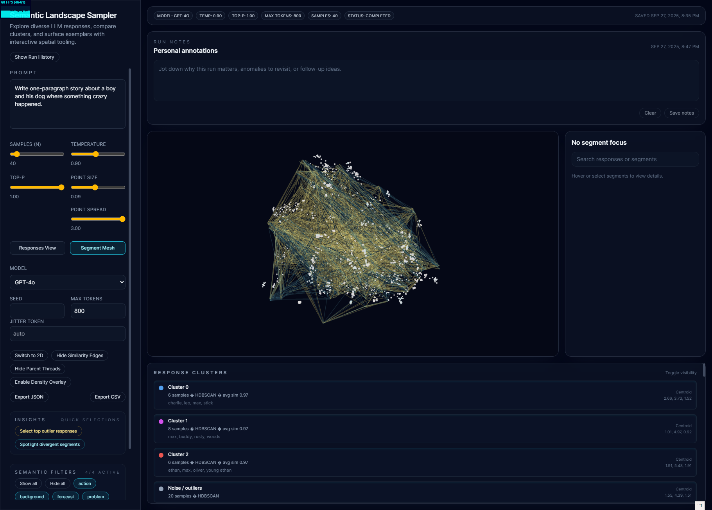
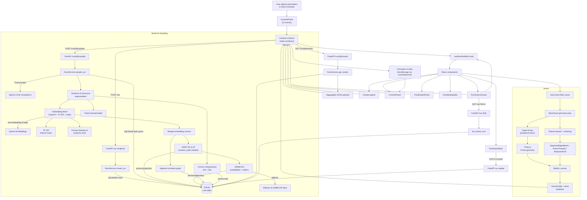
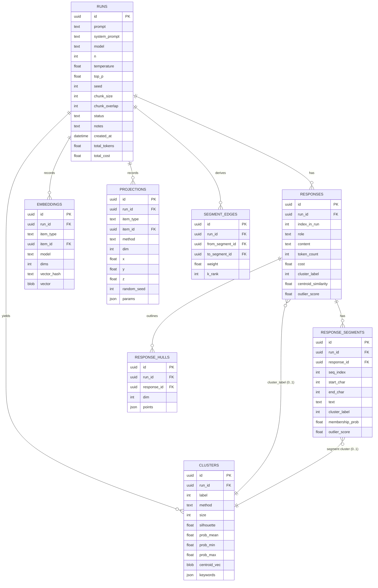
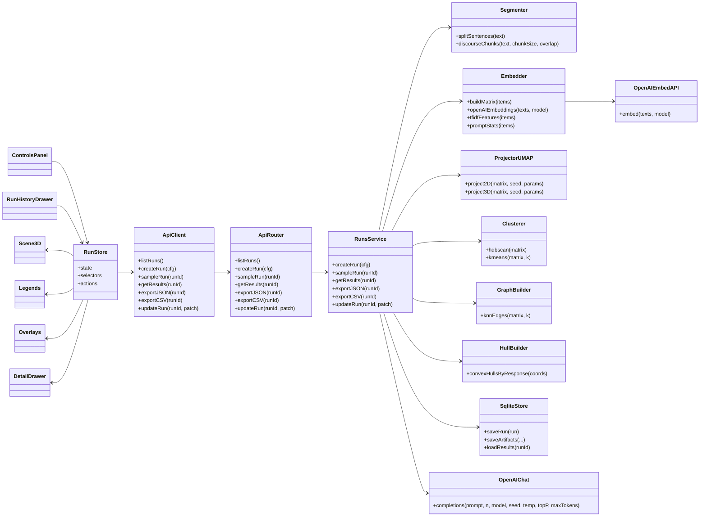

# Semantic Landscape Sampler


[](./2025-09-27_17-46-43.mp4)

Semantic Landscape Sampler fans a single question out across many LLM completions, stores every artifact, and turns the results into an explorable semantic landscape. The backend handles sampling, embeddings, dimensionality reduction, clustering, and persistence; the frontend delivers an interactive 2D/3D point cloud with overlays for segments, similarity edges, and response hulls.

## Table of Contents
- [Semantic Landscape Sampler](#semantic-landscape-sampler)
  - [Table of Contents](#table-of-contents)
  - [Overview](#overview)
  - [Plain-English Tour](#plain-english-tour)
  - [Key Capabilities](#key-capabilities)
    - [Backend](#backend)
    - [Frontend](#frontend)
  - [Architecture](#architecture)
  - [Prerequisites](#prerequisites)
  - [Environment Configuration](#environment-configuration)
  - [Backend Setup](#backend-setup)
  - [Frontend Setup](#frontend-setup)
  - [Running the Stack](#running-the-stack)
  - [Using the Visualiser](#using-the-visualiser)
    - [Controls Reference](#controls-reference)
    - [Exploration Tips](#exploration-tips)
  - [Data Model and Persistence](#data-model-and-persistence)
  - [API Endpoints](#api-endpoints)
  - [Testing and Quality Gates](#testing-and-quality-gates)
    - [Backend](#backend-1)
    - [Frontend](#frontend-1)
  - [Seed Sample Data](#seed-sample-data)
  - [How Is This Mapped?](#how-is-this-mapped)
  - [Roadmap and Next Steps](#roadmap-and-next-steps)
  - [Contributing](#contributing)
  - [Rendering Pipeline (Mermaid)](#rendering-pipeline-mermaid)

## Overview

Semantic Landscape Sampler is built for rapid sense-making of large language model responses. Instead of skimming dozens of plain text completions, you can project them into a shared embedding space, inspect clusters, surface outliers, and drill into individual sentences. The project is intentionally split into a stateless API layer and a rich browser client so that analytics workloads, automation, or other frontends can reuse the same contracts.

Recent updates:
- Segment overlays (thread mesh, similarity edges, response hulls) now share the exact same scaling pipeline as the rendered point cloud, so point spread tweaks keep everything aligned.
- Run controls let you tune segment chunk size and overlap directly from the UI alongside prompt/system message inputs, making it easier to steer segmentation without code changes.
- Sequence-aware point colouring highlights completion order and segment progression so spatial patterns line up with chronology.


## Plain-English Tour

Think of the app as building a map of ideas. Every answer (and even each sentence inside an answer) becomes a dot. Dots that land close are talking about similar things; dots that land far apart are covering different ideas. Here is the journey end-to-end without any jargon:

1. **Collect the text you want to look at.** You pose one question and ask an LLM for N completions. You can also split each completion into smaller pieces—sentences, clauses, or discourse segments—so the map can show both whole answers and their ingredients. Each run can also carry a custom system message if you want to steer tone or persona.
2. **Describe each piece with numbers.** Computers compare numbers, so each response/segment gets a long numeric profile that captures its meaning. We blend three ingredients: an OpenAI embedding (semantic meaning), a TF-IDF “word fingerprint,” and lightweight prompt-similarity/stats features. Put together, that blend is the item’s fingerprint. You choose which OpenAI embedding model (large, small, Ada) drives this blend when you generate a run.
3. **Squash the high-dimensional fingerprints into coordinates.** UMAP compresses those long vectors into just three numbers (x, y, z) for the 3D view and two numbers (x, y) for the flat map. The axes are not labeled “topic” or “sentiment”; they are simply directions that keep similar fingerprints near each other.
4. **Persist coordinates, clusters, and overlays.** Each item stores both projections, outlier scores, and cluster metadata. A fixed random seed keeps layouts stable across runs so you can compare experiments.
5. **Find structure and relationships.** HDBSCAN (with a KMeans fallback) groups nearby dots and computes probabilities. We also build similarity edges, parent/segment thread lines, and response hull outlines—all using the same scaling as the point positions.
6. **Render and explore.** The frontend feeds the coordinates into a react-three-fiber scene. You get orbit/zoom controls, hover tooltips, lasso selection, legends, density heatmaps, and detail drawers that show the raw text and metrics. A 2D projection powers screenshots and exports.
7. **Take your insights elsewhere.** Filters let you focus on roles, clusters, or outliers; notes capture context; exports deliver JSON/CSV with text, coordinates, and cluster labels for downstream analysis.

If you remember only one thing: meaning lives in who is near whom. Axis labels are abstract, but proximity, clusters, and overlays reveal how ideas cluster, contrast, and diverge.

## Key Capabilities

### Backend
- FastAPI + SQLModel service layer with async persistence to SQLite during local development.
- OpenAI Chat Completions for generation (gpt-5-codex, gpt-4.1, or user-supplied models).
- Embedding blend: OpenAI text-embedding-3-large (small fallback), TF-IDF, prompt similarity, and lightweight statistics.
- Dimensionality reduction via deterministic UMAP for 3D and 2D projections (shared random state for reproducibility).
- Clustering with HDBSCAN plus a KMeans fallback. Each cluster tracks membership probability, centroid similarity, keyword themes, silhouette, and outlier scores.
- Response segmentation, optional discourse tagging, similarity graph construction, response hull computation, and parent thread stitching.
- Clean JSON schemas via Pydantic for run configuration, results payloads, and exports.
- Cost accounting and usage summaries via per-model pricing tables for completions and embeddings.

### Frontend
- React + Vite + Tailwind + Zustand application scaffolded for fast iteration.
- react-three-fiber + drei rendering of the point cloud, complete with hover tooltips, lasso selection, camera controls, Stats overlay, and density heatmaps.
- Sequence-aware colour palettes tint responses and segments by completion order, so spatial clusters carry timeline context.
- Response vs segment modes, cluster legends, role filters, similarity edges, parent thread meshes, and convex hull overlays.
- Detail drawer for metrics, raw text, embeddings, and parent response context.
- Run history drawer, run metadata bar, notes editor, quick outlier selectors, and exports that mirror backend payloads (JSON and CSV).

## Architecture

```
backend/
  app/
    api/            # FastAPI routers (runs, sampling, exports)
    core/           # Settings, environment, feature flags
    db/             # SQLModel session helpers
    models/         # SQLite table declarations
    schemas/        # Pydantic response/input models
    services/       # Sampling, embedding, projection, clustering
    utils/          # Tokenisation helpers and shared maths
  tests/            # Pytest suites with OpenAI fixtures and projection goldens
frontend/
  src/
    components/     # Controls, scene, drawers, legends, overlays
    hooks/          # Run workflow orchestration
    services/       # REST API client helpers
    store/          # Zustand store + selectors
    types/          # Shared API types and Zod schemas
    setupTests.ts   # Vitest + Testing Library config
  package.json      # Scripts (dev, build, lint, test)
  vite.config.ts    # Vite + React config
.github/
  workflows/ci.yml  # Format, lint, and test gates for both stacks
```

## Prerequisites

- Python 3.11 or 3.12
- Node.js 20.x with Corepack (pnpm) enabled
- An OpenAI API key with access to the desired chat and embedding models
- (Optional) uv if you prefer its virtualenv workflow

## Environment Configuration

1. Copy the sample environment file and fill in secrets:
   ```bash
   cp .env.example .env
   ```
2. Set at minimum `OPENAI_API_KEY`. Optional overrides include `OPENAI_CHAT_MODEL`, `OPENAI_EMBEDDING_MODEL`, `OPENAI_EMBEDDING_FALLBACK_MODEL`, `ENABLE_DISCOURSE_TAGGING`, `SEGMENT_WORD_WINDOW`, `SEGMENT_WORD_OVERLAP`, and `PROJECTION_MIN_DIST`.
3. Backend reads `.env` for FastAPI configuration. The frontend will proxy requests to `VITE_API_BASE_URL` when set (defaults to http://localhost:8000). Keep secrets out of version control.

## Backend Setup

```bash
cd backend
python -m venv .venv  # or: uv venv
source .venv/bin/activate
pip install -r requirements.txt
```

Launching the API during development:

```bash
source .venv/bin/activate
uvicorn app.main:app --reload --port 8000
```

The backend automatically initialises the SQLite schema on first run. If you upgrade from an older database image and encounter missing columns (for example, notes), delete backend/data/semantic_sampler.db or run the migration snippet in AGENTS.md.

## Frontend Setup

```bash
cd frontend
corepack enable
pnpm install
pnpm dev -- --open
```

By default Vite serves on http://localhost:5173 and proxies API calls to http://localhost:8000.

## Running the Stack

1. Start the FastAPI server (uvicorn app.main:app --reload).
2. Start the frontend (pnpm dev).
3. Visit http://localhost:5173 and enter a prompt.
4. Set sampling parameters (N, temperature, top_p, seed, max tokens, model).
5. Click **Generate Landscape** to trigger the /run + /run/{id}/sample workflow.
6. The scene auto-refreshes once the backend persists results; cluster palettes, legends, hulls, and overlays update immediately.

## Using the Visualiser

### Controls Reference
- **Prompt & System Message**: set the user prompt and optional system instructions (leave blank to use the default).
- **Segment Chunk Size & Overlap**: choose how many words feed each window and how much the slices overlap before segmentation.
- **Sampling Sliders (N / Temperature / Top-p)**: sweep how many completions to request and how adventurous they are.
- **Seed & Max Tokens**: lock runs to deterministic seeds and override the completion cap when needed.
- **Embedding Model**: choose which OpenAI embedding variant powers similarity (large vs. small vs. Ada).
- **Jitter Token**: optionally prepend a stable token to each prompt call to nudge diversity without changing the root prompt.
- **Point Spread & Size**: rescale the projection and adjust particle size while keeping segment meshes aligned.
- **View Mode & Level Mode**: switch between 3D/2D cameras and response/segment clouds.
- **Density Overlay**: toggle a screen-space heatmap for dense regions.
- **Cluster Legend**: hover to spotlight a cluster, click to toggle visibility.
- **Role Filters** (segment mode): filter by discourse roles when tagging is enabled.
- **Similarity Edges & Parent Threads**: visualise high-similarity pairs and response hull meshes that now share the same scaling maths.
- **Run History Drawer**: reopen and duplicate stored runs (fetches `/run?limit=...` on demand).
- **Quick Insights**: one-click selectors surface top outlier responses or segments for deeper inspection.
- **Run Notes & Exports**: annotate the run, download matching JSON/CSV payloads, or jump straight into downstream analysis.

### Exploration Tips
- Hover points to preview summary text and metadata.
- Check the metadata bar for model, chunk, token, and cost badges while you compare runs.
- Shift + drag to lasso select; selections drive the details panel.
- Use the run history drawer to reopen prior experiments with stored parameters and notes.
- Export JSON/CSV from the controls panel to analyse in notebooks or BI tools.

## Data Model and Persistence

SQLite schema (simplified):

| Table | Purpose |
| --- | --- |
| runs | Prompt, model, sampling configuration (chunk size/overlap), status, notes. |
| responses | Raw chat completions and metadata (cluster label, centroid similarity, outlier score). |
| response_segments | Sentence/discourse segments tied to parent responses. |
| embeddings | Embedding vectors (responses and segments) for reproducibility. |
| projections | UMAP/t-SNE coordinates in 2D and 3D. |
| clusters | Cluster assignments and stats for responses (segment cluster metrics live on response_segments). |
| segment_edges | High-similarity edges between segments. |
| response_hulls | Convex hull coordinates for each response (2D and 3D). |

Results are returned as a single JSON payload so the frontend can hydrate the scene offline if needed.

## API Endpoints

| Method | Path | Description |
| --- | --- | --- |
| GET | /run | List recent runs for the history drawer (supports ?limit=). |
| POST | /run | Create a run configuration (prompt, sampling params, optional notes). |
| POST | /run/{id}/sample | Execute sampling, segmentation, embedding, projection, clustering, persistence. |
| GET | /run/{id}/results | Fetch the full visualisation payload (responses, segments, clusters, edges, hulls). |
| GET | /run/{id}/export.json | Download results as canonical JSON. |
| GET | /run/{id}/export.csv | Flattened CSV for response-level analytics. |
| PATCH | /run/{id} | Update metadata such as run notes. |

All endpoints return JSON and expect/produce Pydantic schemas located in backend/app/schemas/run.py.

## Testing and Quality Gates

### Backend
```bash
cd backend
source .venv/bin/activate
pytest
ruff check app tests
black app tests --check
```

backend/tests ships fixtures that mock OpenAI calls so the suite runs offline. Golden files cover projection determinism (fixed random state).

### Frontend
```bash
cd frontend
pnpm lint
pnpm test -- --run
```

Vitest is configured for DOM testing (frontend/src/setupTests.ts). When pnpm is unavailable in your shell, install Node 20 and enable Corepack first.

GitHub Actions (.github/workflows/ci.yml) runs formatters, linters, and unit tests for both stacks.

## Seed Sample Data

With both services running:
```bash
curl -X POST http://localhost:8000/run \
  -H "Content-Type: application/json" \
  -d '{"prompt":"How will climate change reshape coastal cities?","n":25,"model":"gpt-4.1-mini","temperature":0.9,"top_p":1.0,"seed":123,"max_tokens":800}'
```

Note the run_id from the response, then:
```bash
curl -X POST http://localhost:8000/run/<run_id>/sample
curl http://localhost:8000/run/<run_id>/results | jq
```

These payloads can be imported directly into the frontend store for demos or regression testing.

## How Is This Mapped?

The picture on screen is the end of a repeatable pipeline that turns raw completions into blended feature vectors, projects them with UMAP, and then rehydrates the geometry in the browser. Here is the full loop:

1. **Generate the text you want to map.** One prompt is fanned out to `n` chat completions (pick any supported GPT family). Each completion is optionally segmented into discourse-aware chunks (sentences/clauses) so you can explore both whole responses and their fragments. Every run and artifact is written to SQLite for reproducibility.
2. **Blend multiple feature views into a single vector.** For every response/segment we concatenate: (a) an OpenAI embedding (`text-embedding-3-large`, with a small-model fallback), (b) TF-IDF weights over the corpus, (c) prompt-similarity features (e.g., cosine distance to the original prompt or seed answer), and (d) lightweight scalar stats such as length. This gives us one high-dimensional feature vector per item.
3. **Project twice with deterministic UMAP.** Using a fixed random seed, we run UMAP two times over the same blended matrix—one projection targets 3D coordinates for the point cloud, the other targets 2D for exports and minimaps. UMAP preserves neighborhood relationships; the three axes are latent directions, not hand-labeled topics.
4. **Persist coordinates and metadata.** Each item stores `coords_3d = [x, y, z]` and `coords_2d = [x, y]`, plus embedding hashes, cluster labels, and outlier scores. Because the seed is shared, repeated runs over identical data remain stable.
5. **Cluster for structure.** HDBSCAN labels dense regions, emits soft membership probabilities, and computes outlier scores; if it cannot converge, a KMeans fallback guarantees a partition. Cluster centroids and keyword themes feed the legend and detail drawers.
6. **Build overlays from the same scale.** From the blended vectors we derive similarity edges (k-NN graph), parent-thread meshes (linking segments back to responses), and convex hulls per response. These overlays now reuse the same center/scale calculations as the point positions so they stay aligned when you tweak the spread slider or camera.
7. **Render with react-three-fiber.** The frontend components pull JSON from `/run/{id}/results`, memoise typed arrays for coordinates/colors, and hand them to `Points` in WebGL. Orthographic/ perspective cameras, lasso selection, density heatmaps, and tooltips all run on top of that base geometry. The 2D projection powers exports and alt views.
8. **Interact, label, export.** Filters (role, cluster, outlier), annotations, and history management all mutate the Zustand store. Exports include text, blended features, clusters, and both coordinate sets so downstream workflows can replay the map.

> **Why don’t the axes say “topic” or “sentiment”?** Because UMAP is a manifold learner: it pulls high-dimensional neighborhoods into three latent directions that best preserve proximity. Semantic meaning lives in closeness, clusters, hulls, and edges—not in the individual axis labels.

If you want to tune the layout, play with the UMAP parameters in the backend configuration (`n_neighbors`, `min_dist`, `metric`) and keep them aligned with any k-NN edge building so the overlays remain faithful.

## Roadmap and Next Steps

- Integrate pnpm into the CLI image so Vitest can run locally and in CI without manual setup.
- Publish OpenAI mocking recipes for CI in the onboarding docs.
- Layer in model comparison overlays and richer topic labelling (see AGENTS.md).
- Add camera bookmarks and saved viewpoints per run.

## Contributing

Issues and pull requests are welcome. Please run the backend and frontend test suites (or note why they could not be executed) before submitting changes. Review the mission details in AGENTS.md for broader context and follow the style guides enforced by Ruff, Black, ESLint, and Prettier.

Happy sampling!

## Rendering Pipeline (Mermaid)



## Data model (ER diagram)


## System architecture (class diagram)


## Run lifecycle (sequence)
```mermaid
sequenceDiagram
  autonumber
  actor User
  participant UI as ControlsPanel (UI)
  participant Store as RunStore (Zustand)
  participant API as API Client
  participant BE as FastAPI Router
  participant Svc as RunsService
  participant OAIC as OpenAI Chat
  participant OAIE as OpenAI Embeddings
  participant DB as SQLite

  User->>UI: Set prompt + params, click Generate
  UI->>Store: mutate(runConfig)
  Store->>API: POST /run
  API->>BE: /run
  BE->>Svc: create_run(cfg)
  Svc->>DB: insert RUNS
  DB-->>Svc: run_id
  Svc-->>BE: run_id
  BE-->>API: run_id
  API-->>Store: run_id

  Store->>API: POST /run/{id}/sample
  API->>BE: /run/{id}/sample
  BE->>Svc: sample_run(id)

  Svc->>OAIC: n chat completions
  OAIC-->>Svc: responses
  Svc->>Svc: segmentation (sentences/discourse)
  Svc->>OAIE: embed texts (responses + segments)
  OAIE-->>Svc: vectors
  Svc->>Svc: blend (OpenAI + TF-IDF + stats)
  Svc->>Svc: UMAP 3D + 2D (seeded)
  Svc->>Svc: HDBSCAN (+KMeans fallback)
  Svc->>Svc: kNN edges + convex hulls
  Svc->>DB: persist responses/segments/embeddings/ projections/clusters/edges/hulls

  Store->>API: GET /run/{id}/results
  API->>BE: /run/{id}/results
  BE->>Svc: get_results(id)
  Svc->>DB: fetch full payload
  DB-->>Svc: rows
  Svc-->>BE: JSON (coords, clusters, edges, hulls, text)
  BE-->>API: JSON
  API-->>Store: hydrate
  Store-->>UI: render Scene3D + overlays + drawers
  ```
